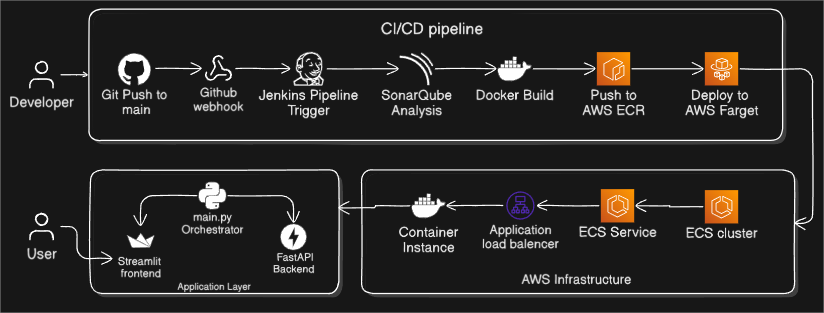
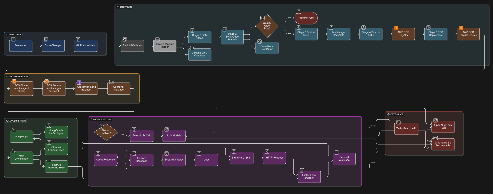

# PolyAiAgent-pipeline

Production-grade multi-agent LLM orchestration platform with enterprise CI/CD pipeline and cloud-native deployment.

## Infrastructure Architecture



- **Compute**: AWS ECS Fargate serverless containers
- **Registry**: AWS ECR private container registry
- **CI/CD**: Jenkins with Docker-in-Docker (DinD) capability
- **Code Quality**: SonarQube static analysis integration
- **Runtime**: FastAPI REST API + LangGraph ReAct agents

## CI/CD Pipeline

### Jenkins Pipeline Stages
1. **SCM Integration**: GitHub webhook-triggered builds
2. **Static Analysis**: SonarQube code quality gates
3. **Container Build**: Multi-stage Docker builds with layer caching
4. **Registry Push**: AWS ECR image versioning and tagging
5. **Deployment**: ECS Fargate rolling updates with zero downtime

### Infrastructure Components
```
├── Jenkinsfile                # Declarative pipeline configuration
├── custom_jenkins/Dockerfile  # Jenkins DinD container setup
├── Dockerfile                 # Multi-stage application container
└── app/                       # Application source code
```

### AWS Services Integration
- **ECS Cluster**: `multi-aiagent-cluster`
- **ECS Service**: `multi-ai-agent-service-1`
- **ECR Repository**: `multiaiagent`
- **Region**: `us-east-1`

## Application Stack

- **LLM Models**: `llama-3.3-70b-versatile`, `openai/gpt-oss-120b`
- **Agent Framework**: LangGraph ReAct pattern
- **API Gateway**: FastAPI with Pydantic validation
- **Search Integration**: Tavily API

## Deployment

### Production (AWS ECS Fargate)
```bash
# Triggered via Jenkins pipeline
aws ecs update-service --cluster multi-aiagent-cluster \
  --service multi-ai-agent-service-1 --force-new-deployment
```

### Local Development
```bash
docker build -t multiaiagent .
docker run -p 8000:8000 -p 8501:8501 multiaiagent
```

## API Specification

```http
POST /chat
Content-Type: application/json

{
  "model_name": "llama-3.3-70b-versatile",
  "system_prompt": "You are a helpful assistant",
  "messages": ["Hello"],
  "allow_search": false
}
```

## Environment Configuration

```bash
GROQ_API_KEY=<groq_api_key>
TAVILY_API_KEY=<tavily_api_key>
AWS_REGION=us-east-1
ECR_REPO=multiaiagent
```

## Complete Architecture


